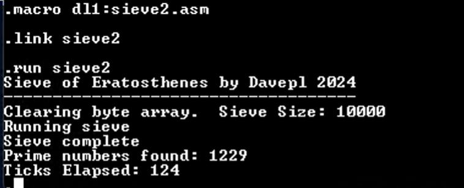

# MACRO-11 solution by davepl


## Description

This solution provides two implementations in [MACRO-11](https://en.wikipedia.org/wiki/MACRO-11), that being the macro assembly language for the [DEC PDP-11](https://en.wikipedia.org/wiki/PDP-11) range of computers.

## Implementations and sieve sizes

This solution includes two implementations:

- One ([SIEVE.ASM](SIEVE.ASM)) uses one byte per prime candidate. Due to applicable memory constraints, the sieve size for this implementation is 1,000.
- The other ([SIEVE2.ASM](SIEVE2.ASM)) uses one bit per prime candidate. This implementation's sieve size is 10,000.

## Run instructions

This solution's implementations can be assembled and executed on an actual PDP-11 computer or a sufficiently complete emulator, provided it's running an operating system that has MACRO-11 installed. A list of available emulators can be found in the [Emulators section on the PDP-11 Wikipedia page](https://en.wikipedia.org/wiki/PDP-11#Emulators).

Use the following commands to edit, assemble and run an implementation on the solution. These specific commands apply to a PDP-11 running RT-11 and build and run SIEVE2.ASM which is located on the D1 device. Adapt the commands for your specific situation where appropriate:

```text
macro d1:sieve2.asm
link sieve2
run sieve2
```

## Results

This is an image showing the results of an execution of SIEVE2.ASM on an actual PDP11/34. The "Ticks" that are reported are time units equal to 1/60th of a second on PDP-11s that are connected to a 60Hz power grid. On machines that are powered from a 50Hz grid, a tick _may_ be 1/50th of a second instead, but that is not always the case.


